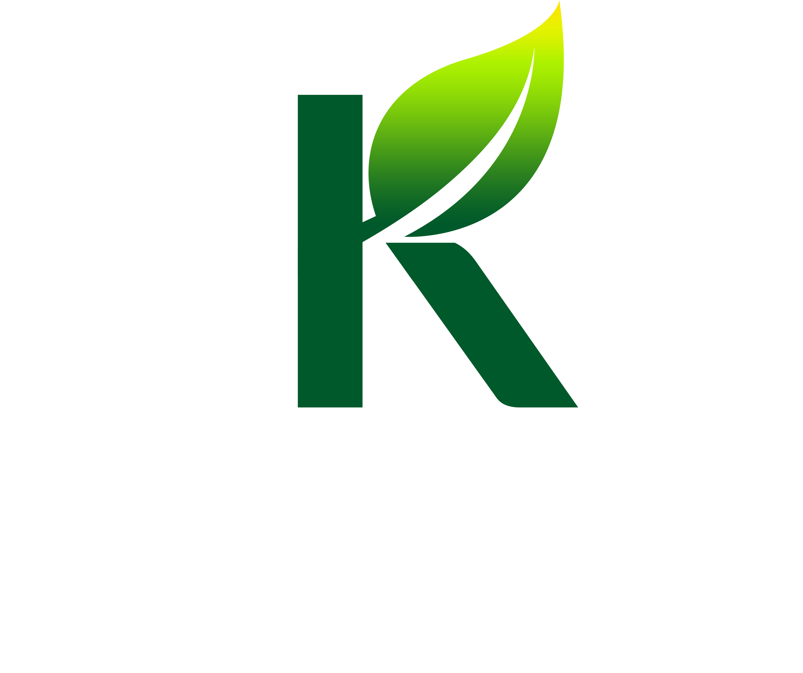

<div align="center">



# 🧼 **Klean App**
### _React Native (Expo) · TypeScript · i18n · Animated_

🌍 Onboarding moderno con selección de idioma, animaciones fluidas y flujo base de login/signup.

[](https://expo.dev/)
[](https://www.typescriptlang.org/)
[](https://reactnative.dev/)
[](#-licencia)

</div>

---

## 🧭 **Descripción**

Onboarding con **selección de idioma (i18n)**, pantallas de *loading/start*, *access*, carrusel de tutoriales con animaciones y puntos interactivos, y flujo base de **login/signup**.  
Construida con **Expo Router**, **TypeScript**, **react-i18next**, **expo-image** y **Animated**.

---

## ⚙️ **Requisitos**

- **Node 18+**
- **Expo CLI**
  ```bash
  npm i -g expo-cli


## 🧩 **Instalación**
# 1️⃣ Instalar dependencias
npm install

# 2️⃣ Instalar pods de iOS (solo en macOS)
npx pod-install

# 3️⃣ Ejecutar
npm run start
# o directamente
npm run ios
npm run android
